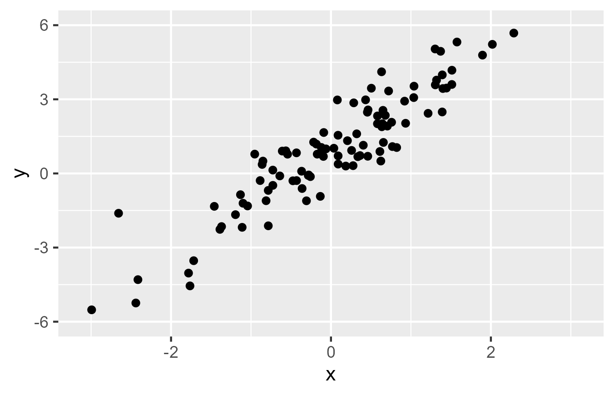

```{r,include=F}
set.seed(123)
options(width=60)
knitr::opts_chunk$set(fig.align='center',fig.width=9,fig.height=5,message=F,warning=F)

library(tidyverse)
library(patchwork)

debt <- read_rds("https://github.com/jbisbee1/DS1000_F2026/raw/main/data/sc_debt.Rds") %>%
  filter(adm_rate > 0, md_earn_wne_p6 > 0, sat_avg > 0)

model_adm <- lm(md_earn_wne_p6 ~ adm_rate, data = debt)
model_sat <- lm(md_earn_wne_p6 ~ sat_avg, data = debt)
coef_adm <- coef(model_adm)
coef_sat <- coef(model_sat)

# ---- Toy data for building visual intuition ----
set.seed(123)
toy <- tibble(X = rnorm(12)) %>%
  mutate(Y = .5 + .8*X + rnorm(12, sd = .7))

toy_rmse <- function(a, b) sqrt(mean((toy$Y - (a + b*toy$X))^2))

# For any slope b, the best intercept passes through (mean X, mean Y).
# Tracing RMSE across slopes gives a curve whose bottom is the lm() slope.
toy_fit <- coef(lm(Y ~ X, data = toy))
best_a <- function(b) mean(toy$Y) - b*mean(toy$X)
rmse_curve <- tibble(b = seq(-1, 2.5, by = .01)) %>%
  mutate(a = best_a(b), rmse = map2_dbl(a, b, toy_rmse))

# Scatter of the toy data with a candidate line and (optionally) residuals.
toy_line <- function(a = NULL, b = NULL, resid = c("none", "one", "all")) {
  resid <- match.arg(resid)
  p <- ggplot(toy, aes(x = X, y = Y)) +
    geom_vline(xintercept = 0, linetype = 'dashed', color = 'grey60') +
    geom_hline(yintercept = 0, linetype = 'dashed', color = 'grey60')
  if (!is.null(a)) {
    if (resid == "one") {
      i <- which.max(abs(toy$Y - (a + b*toy$X)))
      p <- p + annotate('segment', x = toy$X[i], xend = toy$X[i], y = toy$Y[i],
                        yend = a + b*toy$X[i], color = 'red', linewidth = 1.3) +
        annotate('text', x = toy$X[i] + .25, y = (toy$Y[i] + a + b*toy$X[i])/2,
                 label = 'residual', color = 'red', size = 5)
    }
    if (resid == "all") {
      p <- p + annotate('segment', x = toy$X, xend = toy$X, y = toy$Y,
                        yend = a + b*toy$X, color = 'red', linewidth = 1.1)
    }
    p <- p + geom_abline(intercept = a, slope = b, color = 'blue', linewidth = 1.5)
  }
  p + geom_point(size = 3) +
    coord_cartesian(xlim = c(-2.5, 2.5), ylim = c(-3, 4)) +
    theme_minimal(base_size = 16)
}

# Left: the candidate line with residuals. Right: where that line sits on the RMSE curve.
toy_pair <- function(b, show_curve_to = b) {
  force(show_curve_to)
  a <- best_a(b)
  left <- toy_line(a, b, "all") +
    labs(title = paste0("Slope = ", round(b, 2), "   RMSE = ", round(toy_rmse(a, b), 2)))
  right <- ggplot(rmse_curve %>% filter(b <= show_curve_to | b == min(b)), aes(x = b, y = rmse)) +
    geom_line(linewidth = 1.2, color = 'grey40') +
    annotate('point', x = b, y = toy_rmse(a, b), color = 'red', size = 5) +
    coord_cartesian(xlim = range(rmse_curve$b), ylim = c(0, max(rmse_curve$rmse))) +
    labs(x = "Slope of the line", y = "RMSE", title = "How big are the mistakes?") +
    theme_minimal(base_size = 16)
  left + right
}

# ---- Real data: three candidate lines through the running claim ----
earn_rmse <- function(a, b) sqrt(mean((debt$md_earn_wne_p6 - (a + b*debt$adm_rate))^2))
cands <- tribble(
  ~label,                          ~a,                            ~b,
  "Flat: selectivity is irrelevant", mean(debt$md_earn_wne_p6),     0,
  "Too steep",                      70000,                          -50000,
  "Line of best fit",               unname(coef_adm[1]),            unname(coef_adm[2])
) %>%
  mutate(rmse = map2_dbl(a, b, earn_rmse),
         panel = factor(paste0(label, "\nRMSE = $", scales::comma(round(rmse))),
                        levels = paste0(label, "\nRMSE = $", scales::comma(round(rmse)))))

cand_points <- cands %>%
  select(panel, a, b) %>%
  crossing(debt %>% select(adm_rate, md_earn_wne_p6)) %>%
  mutate(yhat = a + b*adm_rate)
```

<style>
.big { font-size: 130%; }
.huge { font-size: 180%; }
.small { font-size: 80%; }
.blue { color: #007bff; }
.red { color: #E74A2F; }
.leftcol { float: left; width: 49%; }
.rightcol { float: right; width: 49%; }
</style>

<!--
LEARNING OBJECTIVES

LO1: Interrogate empirical claims.
LO3: Select and justify analytical approaches.
LO4: Conduct and evaluate data analyses.
LO5: Critically use AI as an analytical tool.
LO6: Communicate evidence responsibly.

Lecture 11 opens the Regression sub-unit of Unit 3. It returns to the
college-selectivity running claim from Units 1-2 (sc_debt.Rds, adm_rate and
sat_avg predicting md_earn_wne_p6) and asks how a line can summarize a
relationship more compactly than group averages. The middle of the deck builds
visual intuition for the line of best fit: residuals, RMSE for competing
lines, the animated search, and the RMSE curve whose minimum lm() finds.
Formal model evaluation (RMSE for assessing fit, logs for skew,
cross-validation) is reserved for Lecture 12 (Regression II).

INSTRUCTOR NOTE:
Keep the p-value/confidence connection brief -- one bridge slide back to
Unit 3's bootstrap material, not a full treatment of inferential statistics.
-->

# How Can a Model Summarize a Relationship?

.big[
So far:

> **How confident should I be in a comparison, given my sample?**

Today:

> **How can I summarize an entire relationship in just a few numbers?**
]

---

# Where We Are

.big[
**Question → trustworthy variables → appropriate comparison → describe the relationship → interrogate explanations → quantify uncertainty → summarize with a model → communicate**
]

Today:

**Summarize with a model**

---

# Back to Our Running Claim

.huge[
> **More selective colleges produce graduates who earn more.**
]

We have described this relationship. We have not yet **summarized** it.

---

# Group Averages, Revisited

In Unit 2, we compared groups using averages:

.big[
average earnings for **less selective** colleges

vs.

average earnings for **more selective** colleges
]

That required chopping a continuous variable into groups.

---

# The Problem With Chopping

```{r,echo=F}
quart <- debt %>%
  mutate(group = ntile(adm_rate, 4)) %>%
  group_by(group) %>%
  summarise(xmin = min(adm_rate), xmax = max(adm_rate),
            mean_earn = mean(md_earn_wne_p6))

p_chop <- debt %>%
  ggplot(aes(x = adm_rate, y = md_earn_wne_p6)) +
  geom_point(alpha = .3) +
  geom_segment(data = quart, aes(x = xmin, xend = xmax, y = mean_earn, yend = mean_earn),
               inherit.aes = FALSE, color = 'red', linewidth = 2) +
  scale_y_continuous(labels = scales::dollar) +
  labs(x = "Admission rate", y = "Median earnings 6 years after entry",
       title = "Average earnings within each quarter of admission rates") +
  theme_minimal(base_size = 16)
p_chop
```

---

# The Problem With Chopping

- Useful, but coarse

--

- Where exactly do the group boundaries go?

--

- Everyone in a group gets the **same** prediction, no matter where they sit within it

--

- And the jumps between groups are artifacts of where we drew the lines

---

# A Smoother Summary

```{r,echo=F}
p_chop +
  geom_smooth(method = 'lm', se = FALSE, color = 'blue', linewidth = 2) +
  labs(title = "Group averages (red) vs. a single line (blue)")
```

---

# A Smoother Summary

.big[
Instead of a few group averages, fit a single **line** through the whole relationship.
]

That line is a **model**: a compact, continuous summary of how $Y$ changes as $X$ changes.

--

- Any straight line can be written:

.huge[
$Y = \alpha + \beta X$
]

- $\alpha$ (the **intercept**): predicted $Y$ when $X = 0$
- $\beta$ (the **slope**): how much $Y$ changes for each one-unit increase in $X$

--

- But there are infinitely many lines. **Which one?**

---

# Building Intuition

.leftcol[

```{r,echo=F,fig.width=5,fig.height=5,out.width='100%'}
toy_line()
```

]

.rightcol[

- Set the real data aside for a moment

- A toy dataset: 12 observations of $X$ and $Y$

- Which straight line best summarizes them?

]

---

# A First Guess

.leftcol[

```{r,echo=F,fig.width=5,fig.height=5,out.width='100%'}
toy_line(a = 0, b = 2)
```

]

.rightcol[

- Try $\alpha = 0$, $\beta = 2$

- Is this a good line?

- How would we even know?

]

---

# Every Line Makes Mistakes

.leftcol[

```{r,echo=F,fig.width=5,fig.height=5,out.width='100%'}
toy_line(a = 0, b = 2, resid = "one")
```

]

.rightcol[

- For every observation, the line makes a prediction $\hat{Y}$

- The **residual** is the mistake:

.big[
$u_i = Y_i - \hat{Y}_i$
]

- The true value minus what the line predicted

]

---

# Every Line Makes Mistakes

.leftcol[

```{r,echo=F,fig.width=5,fig.height=5,out.width='100%'}
toy_line(a = 0, b = 2, resid = "all")
```

]

.rightcol[

- Every point has a residual

- Some are positive (point above the line), some negative (below)

- We need **one number** that summarizes how big all of these mistakes are

]

---

# Measuring Total Error: RMSE

.leftcol[

```{r,echo=F,fig.width=5,fig.height=5,out.width='100%'}
toy_line(a = 0, b = 2, resid = "all") +
  labs(title = paste0("RMSE = ", round(toy_rmse(0, 2), 2)))
```

]

.rightcol[

**R**oot **M**ean **S**quared **E**rror:

1. **Square** every residual (so positive and negative errors don't cancel out)

2. Take their **mean**

3. Take the square **root** (to get back to the units of $Y$)

- **RMSE** = `r round(toy_rmse(0, 2), 2)`

]

---

# Try Another Line

.leftcol[

```{r,echo=F,fig.width=5,fig.height=5,out.width='100%'}
toy_line(a = 1, b = -.5, resid = "all") +
  labs(title = paste0("RMSE = ", round(toy_rmse(1, -.5), 2)))
```

]

.rightcol[

- $\alpha = 1$, $\beta = -0.5$

- **RMSE** = `r round(toy_rmse(1, -.5), 2)`

- Worse! The line slopes the wrong way.

]

---

# Try Another Line

.leftcol[

```{r,echo=F,fig.width=5,fig.height=5,out.width='100%'}
toy_line(a = .5, b = .5, resid = "all") +
  labs(title = paste0("RMSE = ", round(toy_rmse(.5, .5), 2)))
```

]

.rightcol[

- $\alpha = 0.5$, $\beta = 0.5$

- **RMSE** = `r round(toy_rmse(.5, .5), 2)`

- Better. The red lines are getting shorter.

]

---

# The Search for the Best Line

.big[
Imagine trying **every** possible line and keeping track of the RMSE of each one.
]

---

# The Search for the Best Line

<center></center>

---

# The Search for the Best Line

<center></center>

---

# Tracing the RMSE

```{r,echo=F,fig.width=12,fig.height=5}
toy_pair(-.75)
```

---

# Tracing the RMSE

```{r,echo=F,fig.width=12,fig.height=5}
toy_pair(0)
```

---

# Tracing the RMSE

```{r,echo=F,fig.width=12,fig.height=5}
toy_pair(.5)
```

---

# Tracing the RMSE

```{r,echo=F,fig.width=12,fig.height=5}
toy_pair(unname(toy_fit[2]))
```

---

# Tracing the RMSE

```{r,echo=F,fig.width=12,fig.height=5}
toy_pair(1.5)
```

---

# Tracing the RMSE

```{r,echo=F,fig.width=12,fig.height=5}
toy_pair(2.25)
```

---

# The Bottom of the Curve

```{r,echo=F,fig.width=12,fig.height=5}
toy_pair(unname(toy_fit[2]), show_curve_to = Inf) &
  theme(plot.title = element_text(color = 'blue'))
```

.big[
The **line of best fit** is the line at the **bottom** of the RMSE curve.
]

---

# The Bottom of the Curve

- Steeper or flatter than the best line? The mistakes **grow**

--

- Shift it up or down? The mistakes **grow**

--

- The line of best fit is the unique line with the **smallest RMSE**

--

- You never have to search by hand: `R` solves for it directly

---

# Back to the Real Data

```{r,echo=F,fig.width=13,fig.height=5.5}
cand_points %>%
  ggplot(aes(x = adm_rate, y = md_earn_wne_p6)) +
  geom_segment(aes(xend = adm_rate, yend = yhat), color = 'red', alpha = .15) +
  geom_point(alpha = .3, size = .8) +
  geom_abline(data = cands, aes(intercept = a, slope = b), color = 'blue', linewidth = 1.5) +
  facet_wrap(~panel) +
  scale_y_continuous(labels = scales::dollar) +
  labs(x = "Admission rate", y = "Median earnings") +
  theme_minimal(base_size = 15)
```

---

# Back to the Real Data

- Same logic, just more points

--

- The flat line says selectivity doesn't matter: RMSE of $`r scales::comma(round(cands$rmse[1]))`

--

- The too-steep line overreacts: RMSE of $`r scales::comma(round(cands$rmse[2]))`

--

- The line of best fit: RMSE of $`r scales::comma(round(cands$rmse[3]))`

--

- No other straight line does better on these data

---

# R Finds the Best Line For You

The `lm()` function ("linear model") finds $\alpha$ and $\beta$ automatically.

```{r}
model_adm <- lm(formula = md_earn_wne_p6 ~ adm_rate, data = debt)
```

.big[
`md_earn_wne_p6 ~ adm_rate` reads as **"Y explained by X."**

The `~` is R's way of writing an equation without an `=`.
]

---

# What Is `lm()` Actually Doing?

.big[
Out of **all possible lines**, `lm()` picks the one that makes the **smallest squared mistakes**.
]

--

- Squared residuals → averaged → square-rooted = **RMSE**

--

- The line with the smallest RMSE is the line at the **bottom of the curve** we just traced

--

- This is why it's called **least squares** regression

--

.small[
Technically `lm()` minimizes the *sum* of squared residuals, but the same line also minimizes RMSE.
]

---

# Reading the Output

```{r}
summary(model_adm)
```

---

# Interpreting the Intercept

.big[
`(Intercept)` = `r scales::comma(round(coef_adm[1]))`
]

Predicted earnings for a college with an admission rate of **0** (admits no one).

.small[
This is a mathematical extrapolation, not a claim about a real college — no school has `adm_rate = 0`.
]

---

# Interpreting the Slope

.big[
`adm_rate` = `r scales::comma(round(coef_adm[2]))`
]

For each one-unit increase in admission rate, predicted earnings fall by about \$`r scales::comma(abs(round(coef_adm[2])))`.

--

- Careful with the units! `adm_rate` runs from 0 to 1

--

  - A "one-unit increase" means going from 0% to **100%** admitted — the entire range

--

  - A more realistic comparison: **10 percentage points** (0.1) higher → about \$`r scales::comma(abs(round(coef_adm[2]/10)))` **lower** predicted earnings

--

.big[
The sign is negative: **higher admission rate (less selective) → lower predicted earnings.**
]

This matches our running claim's direction.

---

# A Bridge Back to Uncertainty

Look again at the last column of the summary table: `Pr(>|t|)`, the **p-value**.

.big[
Recall Unit 3: we built confidence by resampling.
]

A p-value answers a related question using a formula instead of a bootstrap loop: **how surprising would this estimate be if there were truly no relationship?**

.small[
A small p-value plays a similar role to a high bootstrap confidence. We will not derive the formula in this course — the habit of interpreting the *estimate* is what matters here.
]

---

# Do It Together: A Second Predictor

.blue[Claim]: **Average SAT scores also predict graduate earnings.**

1. Plot $X$ and $Y$, and add the line of best fit.
2. Fit `lm()`.
3. Interpret $\alpha$ and $\beta$.

---

# Visualize

```{r}
debt %>%
  ggplot(aes(x = sat_avg, y = md_earn_wne_p6)) +
  geom_point(alpha = .4) +
  geom_smooth(method = "lm", se = FALSE)
```

---

# Fit

```{r}
model_sat <- lm(md_earn_wne_p6 ~ sat_avg, data = debt)
coef(model_sat)
```

--

.big[
$\widehat{\text{Earnings}} = `r scales::comma(coef_sat[1], accuracy = .01)` + `r sprintf("%.2f", coef_sat[2])` \times \text{SAT}$
]

---

# Communicating the Slope

- The slope is `r sprintf("%.2f", coef_sat[2])`

--

- A good interpretation sentence has four parts:

  1. the **change in X** (with its units)
  2. the **direction** of the change in Y
  3. the **size** of the change in Y (with its units)
  4. the word **"associated"** or **"predicted"** — not "causes"

--

.big[
> **Colleges whose average SAT score is one point higher are associated with about \$`r sprintf("%.2f", coef_sat[2])` higher median graduate earnings.**
]

--

- Or, on a more meaningful scale: a **100-point** higher average SAT → about \$`r scales::comma(round(coef_sat[2]*100))` higher predicted earnings

--

- The sign is positive. Does that make sense given the claim?

---

# Communicating the Intercept

- The intercept is `r scales::comma(coef_sat[1], accuracy = .01)`

--

- Literally: the predicted median earnings for a college whose average SAT score is **0**

--

.big[
> **A college with an average SAT score of 0 would be predicted to have graduates earning about −\$`r scales::comma(abs(round(coef_sat[1])))`.**
]

--

- Does this make sense?

--

  - **No!** Earnings can't be negative, and no college has an average SAT of 0

--

  - (The minimum possible SAT score is 400; the lowest school average in our data is `r min(debt$sat_avg)`)

---

# Why the Intercept Is Nonsense Here

```{r,echo=F,fig.width=11,fig.height=5}
debt %>%
  ggplot(aes(x = sat_avg, y = md_earn_wne_p6)) +
  geom_point(alpha = .3) +
  geom_abline(intercept = coef_sat[1], slope = coef_sat[2], color = 'blue', linewidth = 1.5, linetype = 'dashed') +
  geom_smooth(method = 'lm', se = FALSE, color = 'blue', linewidth = 2) +
  geom_hline(yintercept = 0, color = 'grey40') +
  annotate('point', x = 0, y = coef_sat[1], color = 'red', size = 5) +
  annotate("label", x = 0, y = coef_sat[1], hjust = -.1, vjust = -.4,
           label = paste0("Intercept: at SAT = 0, predicted earnings = -$", scales::comma(abs(round(coef_sat[1])))), color = 'red') +
  annotate('rect', xmin = min(debt$sat_avg), xmax = max(debt$sat_avg), ymin = -Inf, ymax = Inf,
           alpha = .1, fill = 'blue') +
  annotate('text', x = mean(range(debt$sat_avg)), y = 115000, label = "Where our data actually are", color = 'blue') +
  scale_y_continuous(labels = scales::dollar) +
  coord_cartesian(xlim = c(0, 1600), ylim = c(-15000, 125000)) +
  labs(x = "Average SAT score", y = "Median earnings") +
  theme_minimal(base_size = 15)
```

--

- The intercept is an **extrapolation**: the line is extended far outside the data

- It's a mathematical anchor for the line, **not** a meaningful prediction

---

# A Model Is Still Just a Summary

.big[
A regression line describes the **association** as compactly as possible.
]

It does not, by itself, tell us:

- whether selectivity **causes** higher earnings;
- whether a confounder (Unit 2!) explains part of the slope;
- whether this line fits equally well everywhere.

.big[
A small p-value makes us confident the association is **not zero**. It does **not** make it causal.
]

---

# Audit an AI Claim

Suppose an AI assistant sees only the `adm_rate` regression output and says:

> "The negative coefficient proves that admitting fewer students causes graduates to earn more."

.big[
**What does the slope actually describe?**

**What would need to be true for this to be a causal claim?**

**What alternative explanations from Unit 2 still apply here?**
]

A regression coefficient is not immune to confounding.

---

# A Calibrated Conclusion

Instead of:

> "Selectivity causes higher earnings."

Try:

.big[
> **In these data, a one-unit increase in admission rate is associated with about \$`r scales::comma(abs(round(coef_adm[2])))` lower predicted graduate earnings — a compact summary of the association, not evidence that selectivity itself causes the difference.**
]

---

# Before You Leave

When you see a fitted regression line, ask:

1. What does the intercept represent, and is it a meaningful value of $X$?
2. What does the slope represent, in the original units of $Y$ and $X$?
3. Does the sign of the slope match the claim being tested?
4. What is this line minimizing, and what does that criterion assume?
5. What would it take to move from "summarizes the association" to "identifies the cause"?

---

# The Rule to Remember

.huge[
**A regression line is a summary, not a verdict.**
]

It compresses a relationship into two numbers. It does not, on its own, resolve *why* the relationship exists.

---

# Homework 9

You will practice:

- fitting a linear model with `lm()`;
- interpreting an intercept and a slope in context;
- checking whether a slope's sign matches a claim;
- auditing an AI claim that treats a coefficient as causal;
- writing a calibrated conclusion about a regression result.

Next:

.big[
**Regression II**
]
