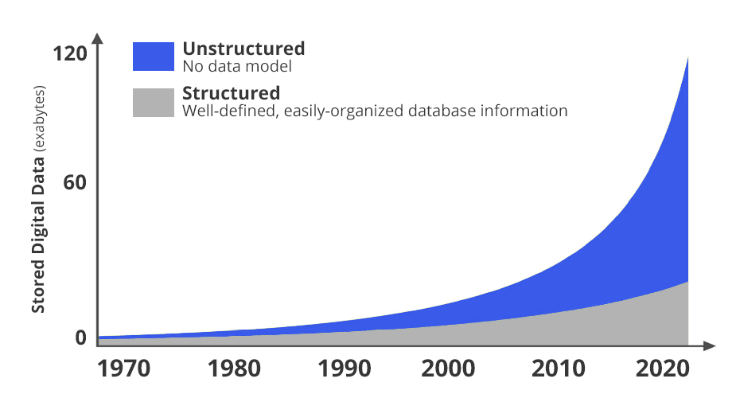
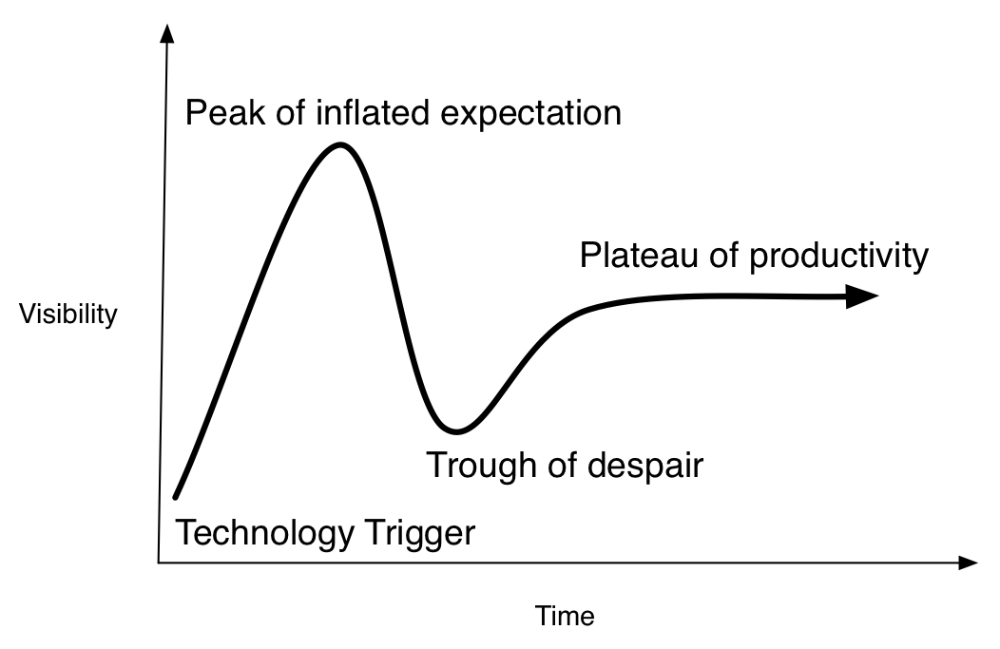
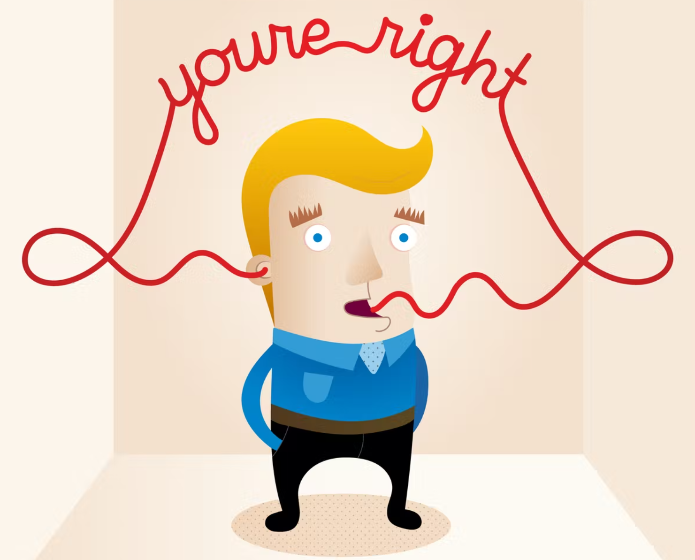
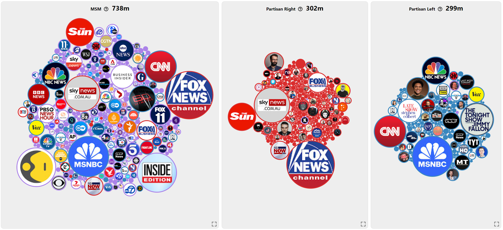
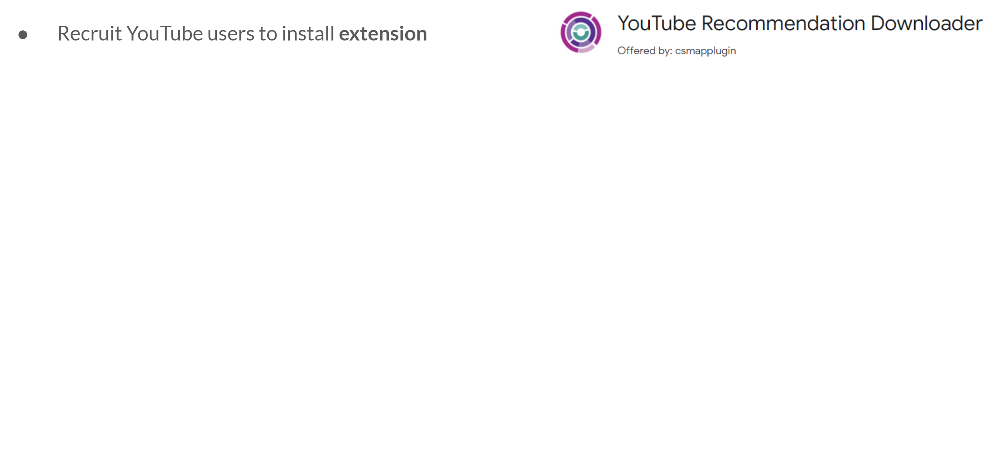
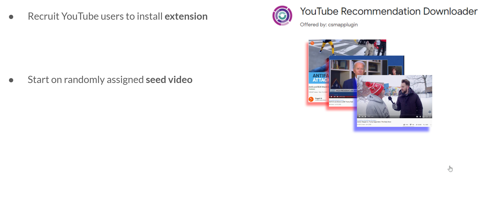
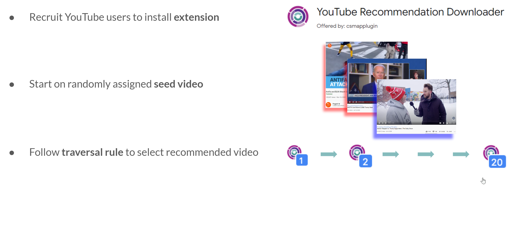
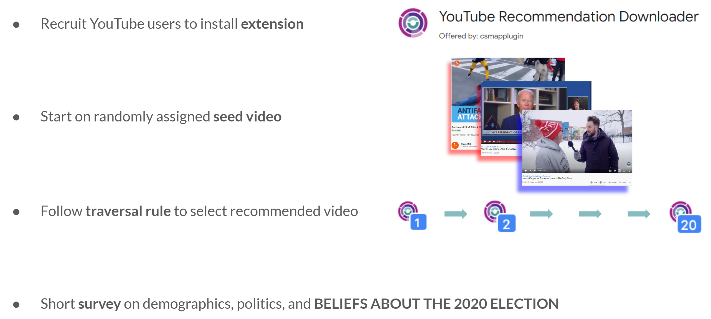
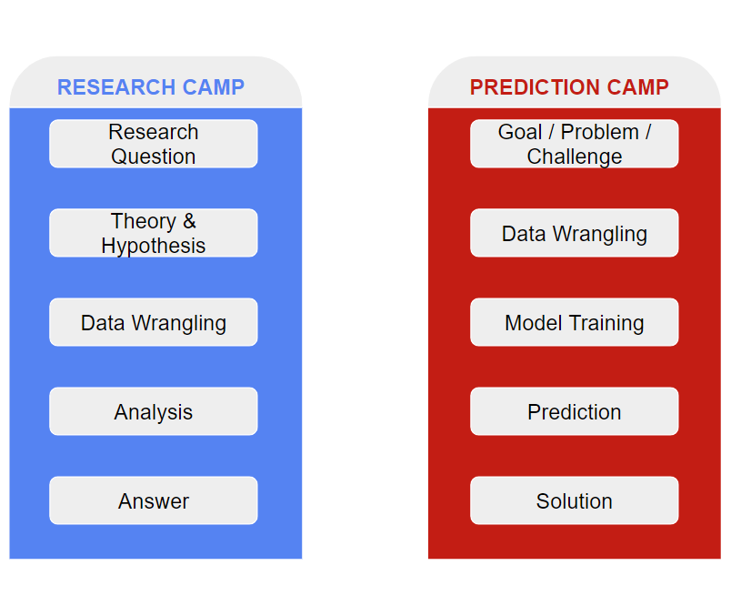

# How do we know what's true?

.big[Someone tells you something is true.]

--

What should you do next?

---

# A few claims

> **Claim 1:** YouTube puts users into political echo chambers.

> **Claim 2:** College is a good financial investment.

> **Claim 3:** An AI system is 95% accurate.

--

.big[What would you need to know before believing any of these?]

---

# The first habit of this course

Don't start with:

> **"Is this true?"**

Start with:

> **"What evidence would let me decide?"**

--

That question forces us to ask:

- What exactly is the claim?
- What would we observe if it were true?
- What data would we need?
- What comparisons would matter?
- What else could produce the same pattern?

---

# This is what data science is for

Data science is not one method, one software package, or one industry.

It is a collection of tools for turning questions into evidence.

--

The tools include:

- computing
- data wrangling
- visualization
- statistics
- modeling
- prediction

--

But the goal is not the tool.

**The goal is better judgment.**

---

# The recurring workflow

.center[

**Question**

↓

**Decompose**

↓

**Choose evidence / method**

↓

**Analyze**

↓

**Evaluate**

↓

**Communicate**

]

---

# Where I come from

My work uses data science to answer questions about:

- YouTube + polarization
- Twitter + misinformation
- Telegram + extremist communities
- Stocks + politicians

--

The common thread is simple:

> **Start with a claim or question. Build evidence that can bear on it. Decide what the evidence supports.**

---

# Why are you here?

---

# Why are you here?

---

# Why are you here?

---

# Why are you here?

---

# Why are you here?

---

# Data science is broad

There are many different questions that can be answered with data.

--

There are also many different ways to answer them.

--

That is why this course is a **menu, not the food**:

> We will sample many tools so you can recognize what they are good for and know where to go deeper.

---

# But data science is not a fad

---

# Still: hype exists

---

# Unknown Problem #1

You are shown this claim:

> **"YouTube's recommendation system creates political echo chambers."**

--

### Do not analyze yet.

First: **What would have to be true for this claim to be correct?**

---

# Decompose the claim

A single sentence hides several different questions.

**What is an "echo chamber"?**

**What does YouTube recommend?**

**What political content are users starting from?**

**What happens after several recommendations?**

**What would count as evidence of an effect?**

--

This is **computational thinking**: breaking a messy problem into tractable parts.

---

# From observation to question

--

Data can help us notice patterns we would not notice otherwise.

But a pattern is not yet an answer.

---

# Observation → question

---

# Observation → question

---

# The substantive question

> **Does YouTube's algorithm put users into political echo chambers?**

--

That question is useful because it tells us what evidence we need.

---

# Theory and hypotheses

Evidence does not interpret itself.

A theory gives us an expectation about what we should observe if a mechanism is operating.

--

For this study:

> People often prefer information that fits with what they already believe.

> YouTube wants users to watch more videos.

--

A possible hypothesis follows:

> **Users should receive increasingly ideologically similar recommendations.**

---

# Two kinds of data-science questions

### Inference / explanation

> **What is true? Why?**

### Prediction

> **What is likely to happen?**

--

The same data can sometimes support both goals, but the questions and standards of success differ.

---

# The research workflow

1. Observation
2. Question
3. Theory / expectations
4. Data collection
5. Analysis
6. Results
7. Conclusion

--

The point is not to memorize the sequence.

The point is to understand **why each step exists**.

---

# Data collection is part of the argument

---

# Data collection is part of the argument

---

# Data collection is part of the argument

---

# Data collection is part of the argument

---

# Why does this matter?

The analysis cannot rescue data that do not actually measure the thing we care about.

--

Ask:

> **What exactly was measured?**

> **Who or what is represented in the data?**

> **What is missing?**

> **Could the way we collected the data create the pattern we see?**

---

# Analysis is another set of choices

Once we have data, we still have to decide:

- which variables matter;
- which comparisons answer the question;
- which visualization is appropriate;
- which statistical model, if any, is appropriate;
- how uncertainty should be represented.

--

**There is no button labeled "analyze."**

---

# Results are not conclusions

A statistical result is an input into reasoning, not the end of it.

--

Ask:

> What does the result actually establish?

> What does it not establish?

> How uncertain is it?

> What alternative explanation remains?

---

# The final step: communicate

A good data scientist should be able to say:

> **Here is what we found.**

> **Here is how strongly the evidence supports it.**

> **Here is what we cannot conclude.**

--

This is part of the analysis, not decoration added at the end.

---

# A second version of the YouTube problem

Instead of asking:

> **Does YouTube create echo chambers?**

suppose we ask:

> **Can we predict the ideology of a YouTube video?**

--

Now the goal is different.

---

# Prediction

--

For prediction, we care about whether a model can make useful predictions on new observations.

The question is less about **why** a particular observation occurs and more about **how accurately we can predict it**.

---

# Same broad toolkit, different question

| Question | Goal | What counts as success? |
|---|---|---|
| **Inference / explanation** | Learn something about the world | Evidence supports a defensible conclusion |
| **Prediction** | Forecast unseen outcomes | Predictions perform well on new data |

--

We will encounter both throughout this course.

---

# Now add AI

Suppose you ask an AI assistant:

> "Does YouTube create political echo chambers? Analyze the evidence and give me a conclusion."

--

The model may give you:

- a polished explanation;
- R code;
- visualizations;
- statistical interpretations;
- references;
- a confident conclusion.

---

# Should you believe it?

**Not automatically.**

The same questions still apply:

> What is the claim?

> What evidence would answer it?

> Is the method appropriate?

> Is the analysis correct?

> What assumptions are being made?

> Does the conclusion actually follow?

---

# AI changes the division of labor

AI can increasingly help with:

- generating code;
- summarizing information;
- proposing analyses;
- producing visualizations;
- exploring alternatives.

--

Your job is increasingly to **evaluate and direct the work**.

--

That is why this course teaches both:

**independent competence** and **critical AI use**.

---

# A useful rule for the semester

> **Never confuse an answer with evidence.**

--

That applies to answers produced by:

- politicians
- journalists
- scientists
- friends
- software
- AI
- and me

---

# What you should be able to do by December

1. **Interrogate empirical claims.**

2. **Translate questions into data problems.**

3. **Select and justify analytical approaches.**

4. **Conduct and evaluate data analyses.**

5. **Critically use AI as an analytical tool.**

6. **Communicate evidence responsibly.**

---

# The dream outcome

.huge[Become a principled skeptic.] 

--

When you encounter a claim, be able to ask:

> **What evidence would convince me?**

And when you encounter a puzzle, be able to ask:

> **How can I break this into pieces that I can solve?**

---

# The course in one line

.center[.huge[

**Question → Decompose → Analyze → Evaluate → Communicate**

]]

--

And keep asking:

> **Does the evidence actually support the claim?**

---

# What this means for the semester

### Homework

Practice the reasoning and technical skills before class. AI is encouraged.

### Lab quizzes / exams

Demonstrate what you can do independently. No AI or internet access.

### Evidence Debates

Adjudicate an unfamiliar claim using evidence and defend an individual verdict.

### Project

Formulate your own question, build an analysis, evaluate the evidence, and defend the conclusion.

---

# A note on the rest of the course

This course is broad by design.

You will learn enough about many tools to recognize:

> **What problem does this method solve?**

> **When is it appropriate?**

> **What can it tell me?**

> **What can it not tell me?**

--

The techniques change.

**The reasoning process stays.**

---

# Logistics

0. Install `R` and `RStudio` before the next class.
1. Create an account for an approved AI assistant.
2. Work through `ds1000_hw_1_f2026.Rmd`.
3. Read the syllabus for the course policies, grading, and assessment schedule.
